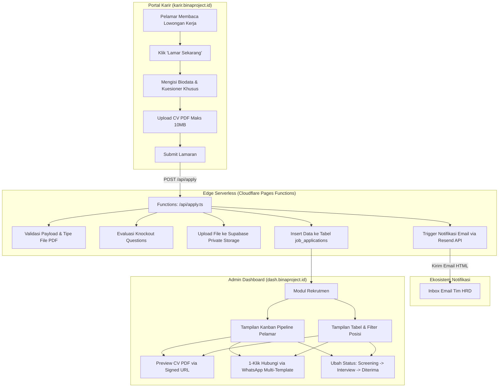

# PRD & Design Spec: Portal Karir & Sistem Rekrutmen Terpadu (ATS) — karir.binaproject.id

**Author:** Antigravity AI  
**Date:** 2026-09-20  
**Project:** Bina Project Construction & Interior  
**Status:** Approved by User via `/grill-me`  
**Target Domain:** `karir.binaproject.id`  

---

## 1. Executive Summary & Goal

Bina Project Construction & Interior membutuhkan platform karir resmi terpadu di subdomain `karir.binaproject.id` untuk mempublikasikan lowongan kerja (arsitek, desainer interior, drafter, pelaksana lapangan, estimator RAB, hingga manajemen), mengumpulkan berkas lamaran secara terstruktur, dan menyaring kandidat terbaik secara efisien.

Sistem ini terbagi menjadi dua pilar utama:
1. **Portal Karir Publik (`karir.binaproject.id`)**: Dibangun dengan Astro 5 untuk performa instan dan dominasi SEO (terindeks langsung di Google Search & Google for Jobs), dilengkapi formulir pelamar multi-tahap dengan kuesioner kualifikasi dinamis per posisi.
2. **Modul Rekrutmen & ATS (`dash.binaproject.id`)**: Terintegrasi langsung di panel admin yang sudah ada, memungkinkan tim HRD/Manajemen mengelola lowongan kerja, memantau pipeline pelamar melalui tampilan Kanban Board interaktif & Tabel, membuka CV PDF secara aman, menambahkan catatan seleksi, serta menghubungi kandidat dengan 1-klik template WhatsApp.

---

## 2. Key Decisions & Specifications (from `/grill-me`)

| Dimensi | Keputusan Desain | Rasional Teknis / Bisnis |
| :--- | :--- | :--- |
| **Arsitektur Aplikasi** | Sub-app Astro 5 di `apps/career/` | Menjamin SEO terbaik (Google for Jobs JSON-LD schema), performa ringan, dan isolasi kode rapi di monorepo. |
| **Deployment** | Cloudflare Pages (`binaproject-career`) | Terhubung ke custom domain `karir.binaproject.id`, konsisten dengan arsitektur multi-app eksisting. |
| **Alur Pelamaran** | Portal Lowongan + Formulir Langsung | Pelamar mengisi biodata, kuesioner dinamis, dan upload CV PDF langsung di web tanpa perlu login. |
| **Formulir Kustom** | Kuesioner Dinamis + Knockout Rules | HRD dapat menyetel pertanyaan khusus per lowongan dengan aturan penyaringan otomatis (*knockout question*). |
| **Backend Processing** | Cloudflare Pages Function (`/api/apply.ts`) | Serverless edge handler untuk validasi berkas, penulisan ke Supabase, dan pengiriman email tanpa mengekspos API key. |
| **Notifikasi Masuk** | Resend API + 1-Klik WhatsApp | Email notifikasi instan terkirim ke email HRD setiap ada lamaran baru, plus tombol WhatsApp template di dashboard. |
| **UI Manajemen Admin** | Kanban Board + Tabel Terpadu | HRD dapat menggeser kartu kandidat antar status seleksi atau menggunakan tabel dengan filter dan pencarian. |
| **Keamanan Berkas CV** | Supabase Private Storage (`job-applications`) | File CV dilindungi RLS, hanya dapat diakses melalui signed URL oleh HRD yang terautentikasi. |
| **Cross-Navigation** | Link di `binaproject.id` & `bio.binaproject.id` | Menghubungkan menu "Karir" di navbar/footer web utama dan tombol khusus di biolink. |

---

## 3. Database Schema & Storage (Supabase)

Migrasi database akan disimpan di `supabase/migrations/20260920_recruitment_system.sql`.

### 3.1 Tabel `job_postings`
Menyimpan data lowongan pekerjaan yang dibuka oleh Bina Project.

```sql
CREATE TABLE IF NOT EXISTS public.job_postings (
    id UUID PRIMARY KEY DEFAULT gen_random_uuid(),
    slug VARCHAR(255) UNIQUE NOT NULL,
    title VARCHAR(255) NOT NULL,
    department VARCHAR(100) NOT NULL, -- 'Arsitektur & Desain', 'Konstruksi & Lapangan', 'Estimator & RAB', 'Marketing & Finance', 'Magang'
    job_type VARCHAR(50) NOT NULL DEFAULT 'Full-time', -- 'Full-time', 'Kontrak', 'Magang / Internship', 'Freelance'
    workplace_type VARCHAR(50) NOT NULL DEFAULT 'On-site', -- 'On-site', 'Hybrid', 'Remote'
    location VARCHAR(255) NOT NULL DEFAULT 'Malang, Jawa Timur',
    experience_level VARCHAR(50) NOT NULL DEFAULT '1-3 Tahun', -- 'Fresh Graduate', '1-3 Tahun', '3-5 Tahun', 'Senior'
    salary_range VARCHAR(100), -- Contoh: 'Rp 3.500.000 - Rp 5.500.000' atau null jika disembunyikan
    show_salary BOOLEAN DEFAULT false,
    description TEXT NOT NULL,
    responsibilities TEXT[] DEFAULT '{}',
    requirements TEXT[] DEFAULT '{}',
    benefits TEXT[] DEFAULT '{}',
    -- Kuesioner dinamis khusus posisi ini (Format JSONB)
    -- Contoh struktur: [{"id": "q1", "question": "Apakah menguasai SketchUp & Enscape?", "type": "radio", "options": ["Ya", "Tidak"], "knockout_value": "Tidak", "required": true}]
    custom_questions JSONB DEFAULT '[]'::jsonb,
    status VARCHAR(20) NOT NULL DEFAULT 'published', -- 'published', 'draft', 'closed'
    application_deadline DATE,
    views_count INT DEFAULT 0,
    created_at TIMESTAMPTZ DEFAULT now(),
    updated_at TIMESTAMPTZ DEFAULT now()
);

CREATE INDEX idx_job_postings_status ON public.job_postings(status);
CREATE INDEX idx_job_postings_department ON public.job_postings(department);
```

### 3.2 Tabel `job_applications`
Menyimpan seluruh data pelamar kerja dan talent pool.

```sql
CREATE TABLE IF NOT EXISTS public.job_applications (
    id UUID PRIMARY KEY DEFAULT gen_random_uuid(),
    job_id UUID REFERENCES public.job_postings(id) ON DELETE SET NULL, -- NULL jika pelamar mengajukan Talent Pool
    job_title VARCHAR(255) NOT NULL, -- Cache judul posisi
    full_name VARCHAR(255) NOT NULL,
    email VARCHAR(255) NOT NULL,
    whatsapp VARCHAR(50) NOT NULL,
    city VARCHAR(100) NOT NULL,
    last_experience TEXT,
    expected_salary VARCHAR(100),
    join_availability VARCHAR(100) NOT NULL DEFAULT 'Segera', -- 'Segera', '1 Bulan', '2 Minggu', dll.
    resume_path TEXT NOT NULL, -- Path file di Supabase private storage
    portfolio_url TEXT, -- Link portfolio (Google Drive, Behance, dll)
    -- Jawaban kuesioner dinamis pelamar
    -- Contoh: {"q1": "Ya", "q2": "3 tahun"}
    custom_answers JSONB DEFAULT '{}'::jsonb,
    is_talent_pool BOOLEAN DEFAULT false,
    screening_status VARCHAR(50) NOT NULL DEFAULT 'review', -- 'passed' (lolos knockout), 'review' (perlu cek manual), 'knocked_out' (tidak memenuhi syarat wajib)
    pipeline_stage VARCHAR(50) NOT NULL DEFAULT 'new', -- 'new' (Masuk), 'screening' (Screening Berkas), 'interview' (Wawancara), 'offering' (Penawaran/Diterima), 'rejected' (Belum Sesuai)
    hr_notes TEXT,
    rating INT DEFAULT 0, -- 0 - 5 stars
    created_at TIMESTAMPTZ DEFAULT now(),
    updated_at TIMESTAMPTZ DEFAULT now()
);

CREATE INDEX idx_job_applications_job_id ON public.job_applications(job_id);
CREATE INDEX idx_job_applications_pipeline_stage ON public.job_applications(pipeline_stage);
CREATE INDEX idx_job_applications_created_at ON public.job_applications(created_at DESC);
```

### 3.3 Storage Bucket Setup & Security Policies
```sql
-- Private Storage Bucket untuk CV & Portofolio Pelamar
INSERT INTO storage.buckets (id, name, public)
VALUES ('job-applications', 'job-applications', false)
ON CONFLICT (id) DO UPDATE SET public = false;

-- Policy: Hanya user admin yang terautentikasi dapat membaca/mengunduh berkas
DROP POLICY IF EXISTS "Admin Read Resumes" ON storage.objects;
CREATE POLICY "Admin Read Resumes"
    ON storage.objects FOR SELECT
    TO authenticated
    USING (bucket_id = 'job-applications');

DROP POLICY IF EXISTS "Admin Manage Resumes" ON storage.objects;
CREATE POLICY "Admin Manage Resumes"
    ON storage.objects FOR ALL
    TO authenticated
    USING (bucket_id = 'job-applications');
```

---

## 4. Arsitektur Sistem & Alur Data



---

## 5. Rincian Fitur Portal Karir (`apps/career`)

### 5.1 Halaman Beranda (`src/pages/index.astro`)
- **Header & Branding**: Navigasi modern dengan logo Bina Project Construction & Interior, tema warna Dark Slate (`#0B132B`) beraksen Amber Gold (`#F68A0A`).
- **Hero Section**: Tagline inspiratif: *"Bangun Mahakarya Arsitektur & Karir Masa Depanmu Bersama Bina Project"*, lengkap dengan statistik (jumlah proyek terselesaikan, kota operasional, tim profesional).
- **Life at Bina Project**: Menampilkan 4 pilar budaya kerja:
  1. *Kebebasan Eksplorasi Desain & Presisi Konstruksi*
  2. *Budaya Kolaboratif & Terbuka*
  3. *Kesempatan Terlibat Proyek Nyata Skala Besar*
  4. *Pengembangan Keahlian Teknis Berkelanjutan*
- **Kategori & Filter Lowongan**: Tab filter departemen (*Semua, Arsitektur & Desain, Lapangan & Konstruksi, Estimator RAB, Marketing & Admin, Magang*).
- **Daftar Kartu Lowongan (Job Cards)**:
  - Judul posisi, departemen badge, tipe kerja (Full-time/Magang), lokasi (Malang, Jawa Timur).
  - Indikator sisa waktu pendaftaran (contoh: *"Batas: 30 September 2026"*).
  - Tombol *"Lihat Detail & Lamar"*.
- **Bagian Talent Pool (Open Application)**: Banner ajakan bagi talenta yang belum menemukan posisi yang sesuai untuk menitipkan CV ke database talent pool.
- **FAQ Rekrutmen**: Pertanyaan umum (tahapan seleksi, waktu respons HRD, lokasi kantor, format CV/portofolio).
- **Footer**: Link ke website utama `binaproject.id`, `bio.binaproject.id`, media sosial, dan kontak resmi.

### 5.2 Halaman Detail Lowongan (`src/pages/loker/[slug].astro`)
- **Header Info Ringkas**: Breadcrumb, judul pekerjaan, badge departemen, lokasi, tipe kerja, estimasi gaji (jika disetel tampil).
- **Struktur Konten Terperinci**:
  - *Tentang Pekerjaan Ini*
  - *Tanggung Jawab Utama*
  - *Kualifikasi & Persyaratan*
  - *Benefit & Fasilitas*
- **Google for Jobs Schema**: Injeksi tag `<script type="application/ld+json">` format `JobPosting` untuk mengindeks lowongan secara native di SERP Google.
- **Sticky Apply Bar**: Tombol lamar melayang di layar mobile dan samping kanan desktop.
- **Fitur Bagikan Loker**: Tombol cepat share ke WhatsApp, LinkedIn, dan salin link.

### 5.3 Formulir Lamaran Interaktif (`ApplicationForm.tsx`)
Komponen React Island multi-tahap (Step-by-Step):
- **Langkah 1: Identitas & Kontak**:
  - Nama Lengkap (Wajib)
  - Alamat Email Aktif (Wajib, validasi email)
  - Nomor WhatsApp (Wajib, format otomatis `+62`/`08`)
  - Kota Domisili Saat Ini (Wajib)
- **Langkah 2: Pengalaman & Berkas**:
  - Pengalaman Terakhir / Pendidikan (Wajib)
  - Kesiapan Mulai Bekerja (Segera / 2 Minggu / 1 Bulan)
  - Ekspektasi Gaji (Opsional/Angka)
  - Upload CV/Resume (Wajib, format PDF, maksimal 10MB, drag & drop)
  - Link Portofolio (Behance/Drive/Website pribadi jika posisi teknis/arsitek)
- **Langkah 3: Kuesioner Khusus Posisi (Dinamis)**:
  - Merender pertanyaan yang dikonfigurasi HRD untuk lowongan tersebut.
  - Mendukung input teks, pilihan ganda, atau pilihan ya/tidak.
- **Langkah 4: Konfirmasi & Kirim**:
  - Ringkasan data sebelum dikirim.
  - Proteksi bot & spam (rate-limit token & honeypot).
  - Progress bar upload berkas dan tampilan layar sukses (Success State) dengan petunjuk proses berikutnya.

---

## 6. Rincian Modul Rekrutmen di Admin Dashboard (`apps/dashboard`)

### 6.1 Menu Navigasi Baru
Menambahkan item navigasi *"Rekrutmen"* dengan icon `Users` di sidebar dashboard admin, dengan 2 sub-halaman:
1. **Lowongan Kerja** (`/recruitment/jobs`)
2. **Kandidat Pelamar** (`/recruitment/candidates`)

### 6.2 Manajemen Lowongan Kerja (`JobManager.tsx` & `JobEditor.tsx`)
- **Tabel Lowongan**: Daftar seluruh loker, jumlah pelamar masuk, status (Aktif, Ditutup, Draft), deadline, tombol aksi Edit / Tutup / Hapus.
- **Form Editor Loker**:
  - Judul, slug URL otomatis, departemen, tipe pekerjaan, tipe tempat kerja, lokasi.
  - Toggle tampilkan gaji + input rentang gaji.
  - Editor teks kaya (Tiptap) untuk deskripsi, daftar tanggung jawab, kualifikasi, dan benefit.
  - **Dynamic Question Builder**:
    - Tombol *"Tambah Pertanyaan Khusus"*.
    - Opsi tipe: Teks Singkat, Pilihan Ganda (Radio), Ya/Tidak.
    - Checkbox *"Pertanyaan Kunci / Kualifikasi Mutlak"* (menentukan apakah jawaban salah langsung menandai pelamar sebagai *Knocked Out* di screening).
    - Status Publikasi & Tanggal Deadline Lamaran.

### 6.3 ATS Pipeline & Manajemen Pelamar (`CandidateManager.tsx`)
- **Tampilan Kanban Board**:
  - Kolom 1: **Masuk / Baru (`new`)**
  - Kolom 2: **Screening Berkas (`screening`)**
  - Kolom 3: **Wawancara / Tes Teknis (`interview`)**
  - Kolom 4: **Diterima / Offering (`offering`)**
  - Kolom 5: **Belum Sesuai (`rejected`)**
  - Fitur drag-and-drop kartu pelamar antar kolom dengan sinkronisasi instan ke Supabase.
- **Tampilan Tabel & Filter**:
  - Tab alternatif untuk melihat semua pelamar dalam format tabel data ringkas.
  - Filter berdasarkan Lowongan, Status Screening (Lolos / Perlu Cek / Knocked Out), dan Pencarian nama/email/kota.
- **Modal Detail Pelamar**:
  - Tampilan profil lengkap pelamar dan jawaban kuesioner dinamis.
  - Badge hasil evaluasi kualifikasi kunci (*Passed Qualification* / *Disqualified*).
  - Tombol **Preview CV PDF** langsung di modal via Supabase Storage signed URL (tanpa perlu download manual).
  - Kolom **Catatan Internal HRD** (untuk mencatat hasil interview, reviewer score, kelebihan/kekurangan).
  - Dropdown pengubah status seleksi dan rating bintang (1-5).
- **1-Klik Hubungi via WhatsApp (Multi-Template)**:
  Tombol interaktif dengan pilihan template siap pakai yang membuka `https://wa.me/62...`:
  1. *Undangan Wawancara Offline / Tatap Muka di Kantor Malang*
  2. *Undangan Wawancara Online (Google Meet / Zoom)*
  3. *Permintaan Dokumen / Portofolio Gambar Kerja Lanjutan*
  4. *Pemberitahuan Lolos Seleksi & Tahapan Penawaran*
  5. *Pesan Bebas Kustom*

---

## 7. Sistem Notifikasi Email (Resend API)

Setiap ada pelamar yang mengirimkan lamaran, edge function `/api/apply.ts` akan mengirimkan email ke alamat tim HRD (`hrd@binaproject.id` / email terdaftar) dengan format HTML modern:

```html
Subject: [Pelamar Baru] {posisi} - {nama_pelamar} ({kota})

Konten:
- Nama Lengkap: {nama_pelamar}
- Posisi: {judul_posisi}
- Kontak WhatsApp: {nomor_wa}
- Email: {email}
- Domisili: {kota}
- Status Kualifikasi: {Lolos Screening Awal / Perlu Review Manual}
- Pengalaman Terakhir: {pengalaman}
- Link Akses Dashboard: https://dash.binaproject.id/recruitment/candidates?id={applicant_id}
```

---

## 8. SEO, Metadata & Google for Jobs

Pada halaman `/loker/[slug].astro`, diinjeksi tag Schema.org berstandar Google Search:

```json
{
  "@context": "https://schema.org/",
  "@type": "JobPosting",
  "title": "Arsitek & Desainer Interior",
  "description": "<p>Deskripsi pekerjaan lengkap...</p>",
  "identifier": {
    "@type": "PropertyValue",
    "name": "Bina Project",
    "value": "BP-JOB-001"
  },
  "datePosted": "2026-09-20",
  "validThrough": "2026-10-20T00:00:00",
  "employmentType": "FULL_TIME",
  "hiringOrganization": {
    "@type": "Organization",
    "name": "Bina Project Construction & Interior",
    "sameAs": "https://binaproject.id",
    "logo": "https://binaproject.id/assets/images/logo.png"
  },
  "jobLocation": {
    "@type": "Place",
    "address": {
      "@type": "PostalAddress",
      "addressLocality": "Malang",
      "addressRegion": "Jawa Timur",
      "addressCountry": "ID"
    }
  }
}
```

---

## 9. Struktur Berkas yang Dibuat & Diubah

```
d:\binaproject\
├── apps\
│   ├── career\                               # [BARU] Proyek Astro karir.binaproject.id
│   │   ├── functions\api\apply.ts            # Serverless Edge Function (Upload & Resend)
│   │   ├── src\
│   │   │   ├── components\
│   │   │   │   ├── Header.astro
│   │   │   │   ├── Footer.astro
│   │   │   │   ├── JobCard.astro
│   │   │   │   ├── CultureSection.astro
│   │   │   │   ├── FaqSection.astro
│   │   │   │   └── form\
│   │   │   │       └── ApplicationForm.tsx   # React Island: Multi-step Application Form
│   │   │   ├── layouts\
│   │   │   │   └── CareerLayout.astro
│   │   │   ├── pages\
│   │   │   │   ├── index.astro               # Portal utama
│   │   │   │   ├── loker\[slug].astro        # Detail loker + Schema.org
│   │   │   │   └── talent-pool.astro         # Halaman open talent pool
│   │   │   ├── lib\supabase.ts
│   │   │   └── styles\global.css
│   │   ├── package.json
│   │   ├── astro.config.mjs
│   │   └── tsconfig.json
│   ├── dashboard\                            # [MODIFIKASI] dash.binaproject.id
│   │   └── src\
│   │       ├── App.tsx                       # Tambah rute /recruitment/*
│   │       ├── components\Sidebar.tsx        # Tambah menu Rekrutmen
│   │       └── pages\
│   │           ├── JobManager.tsx            # Daftar & aksi loker
│   │           ├── JobEditor.tsx             # Form loker + kuesioner dinamis
│   │           └── CandidateManager.tsx      # Kanban Board & Tabel Pelamar + WhatsApp modal
│   ├── biolink\src\App.tsx                   # [MODIFIKASI] Tambah tombol 'Karir di Bina Project'
├── src\components\Footer.astro               # [MODIFIKASI] Tambah link 'Karir'
├── package.json                              # [MODIFIKASI] Skrip dev:career & build:career
└── supabase\migrations\
    └── 20260920_recruitment_system.sql       # [BARU] DDL tabel & bucket
```

---

## 10. Rencana Verifikasi & Pengujian

| Pengujian | Metode | Kriteria Keberhasilan |
| :--- | :--- | :--- |
| **Form Submission & Validasi** | Manual & E2E | Form memblokir jika input tidak valid, ukuran file >10MB, atau bukan PDF. |
| **Penyimpanan Berkas & Privasi** | Supabase Storage Test | File terunggah ke bucket `job-applications`, tidak bisa diakses publik secara anonim, hanya bisa dibuka via signed URL di dashboard. |
| **Kuesioner Dinamis & Knockout** | Unit & Flow Test | Pertanyaan kustom muncul sesuai konfigurasi lowongan; pelamar yang memilih jawaban kualifikasi wajib diberi status `knocked_out` secara otomatis. |
| **Pengiriman Email Resend** | API Test | Email ringkasan pelamar masuk ke inbox HRD dalam hitungan detik setelah submit berhasil. |
| **Kanban Board Drag-and-Drop** | UI Dashboard Test | Kartu pelamar dapat digeser antar kolom status dan tersimpan instan di database. |
| **WhatsApp Multi-Template Link** | Browser Click Test | Tombol WhatsApp membuka `wa.me` dengan teks pesan yang sudah terisi otomatis nama pelamar dan posisi. |
| **Google for Jobs Schema Validasi** | Google Rich Results Test | Schema `JobPosting` valid 100% tanpa error di Google Search Console / Rich Result Testing tool. |
